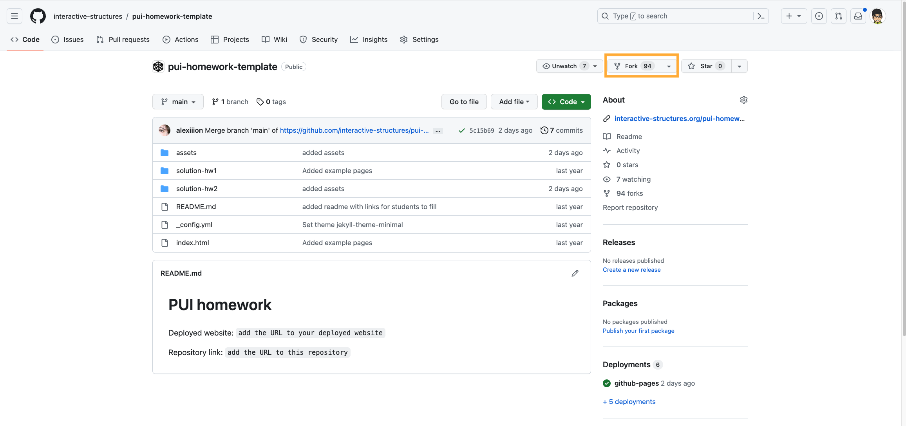
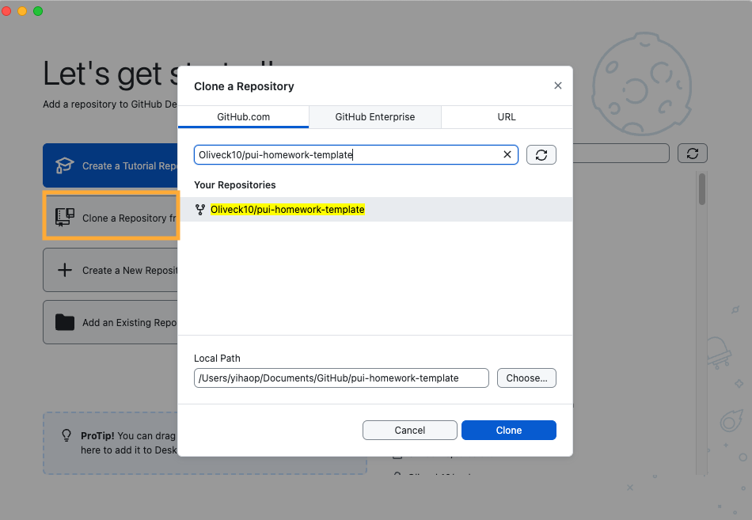
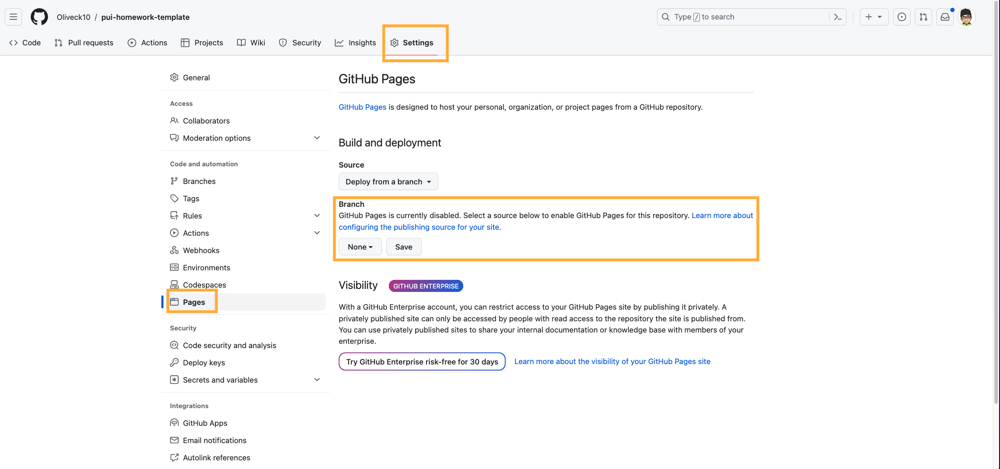
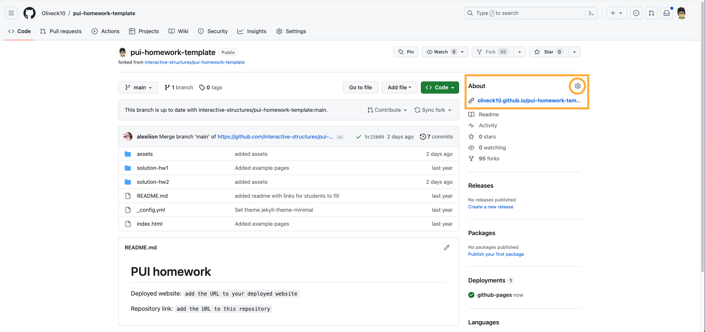
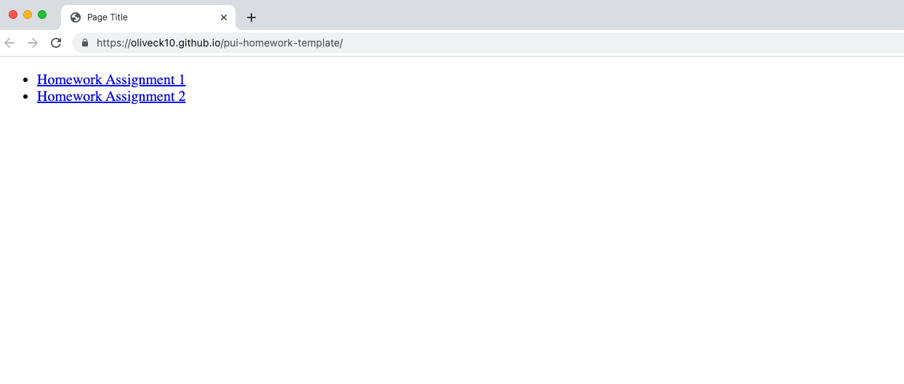
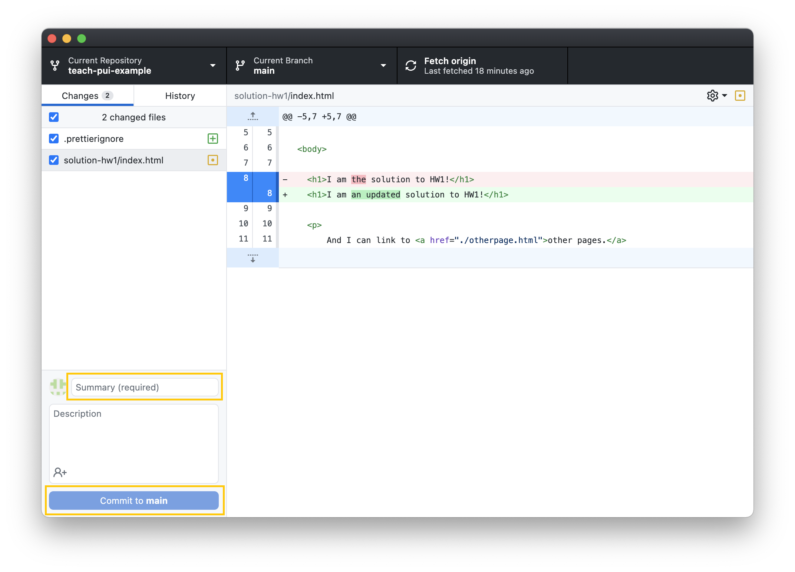
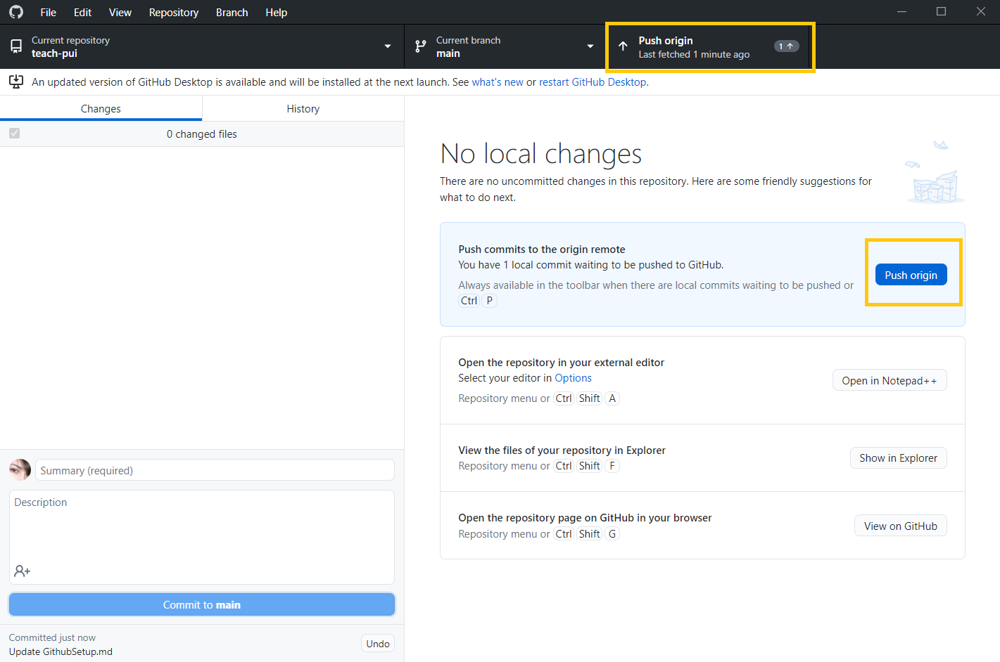

# Deploying Homework Assignments on GitHub

_This tutorial assumes you have set up [GitHub](./GithubSetup.md) and your development environment ([Mac](./DeveloperEnvironment--Mac.md) or [Windows](./DeveloperEnvironment--Win.md)) correctly. If you haven't, go through those tutorials first!_

For the assignments in this class, you will upload all code to a single repository (a.k.a. a folder containing code) in your GitHub account. We'll use a service called GitHub Pages to "serve" that repository as a public website.

## Creating your assignment repository

We have prepared a **Video Tutorial** for this conent as well: https://youtu.be/okINPJAZw6s?si=GDjOscworM3dzVPF 

We recommend you start by "forking" the example repository that we've created for you, called `interactive-structures/pui-homework-template`. To do so, go to the [repository page](https://github.com/interactive-structures/pui-homework-template) and click the Fork button in the upper right. You should see a dialog like this:




You might want to change the repository name field to something more descriptive like "pui-hw" or include your name, but it's up to you. (When you're done with this tutorial, your submissions will be visible at a URL like this: `https://<github-username>.github.io/<repo-name>`.) Click **Create Fork.** This will create a copy of the example repository in your account. 

## Cloning your repo

Now that you've created a fork, you need to "clone" it to your local hard-drive on your computer. Cloning means that you (1) download the content of your forked repository and (2) you let git track your changes such that you can synchonize the online repository easily. To do that, open up *GitHub Desktop*, the app we downloaded in the [GitHub tutorial](./GithubSetup.md). On the main app page, click the **Clone a Repository** button or select **File > Clone Repository**. In the menu that appears, you should see the repo you just forked, like this:



Select the repository and choose a folder on your local computer where you want git to download the code to, if you don't want to use the default paths. This will be the folder you work in for your PUI homework assignments. Then click **Clone**.

## Configuring GitHub Pages

We have prepared a **Video Tutorial** for this conent as well: https://youtu.be/OEPAOjA8vNA?si=JIfOsyLVHEvMiqI7

The last thing we need to do to make sure we can see your completed assignments is to set up GitHub Pages. Remember how your browser needs a server to send it the contents of your webpage? Well, GitHub can act as the server for the code in your repo - but we need to enable that feature first.

To do so, go to your repo's page on GitHub (you can click the **View on GitHub** button in GitHub Desktop, or find it from [github.com](https://github.com)). Now find the Settings tab on that page, and then in the sidebar click Pages. You should see a page like this:



To make your website publicly available, all you need to do is change the **Branch** option from "None" to "main", then click Save. It should look like this:


Now, to get the URL that your site will be available at, replace `<github-username>` with your GitHub handle and `<repo-name>` with the name of your repository:

```
https://<github-username>.github.io/<repo-name>
```

**Important:** Take **your** URL and add it to the description of your repository. 




When you go to your URL, you should see the published website!



## Editing, committing, and pushing

Video tutorial for this next part: https://youtu.be/AZZ1HqMGQAo?si=gcP6ClQelfcc0-s4

You can open up your repo in VS Code and edit it - you can either find it by opening up VS Code and browsing for the directory, or press the **Open in Visual Studio Code** button on the repo page in GitHub Desktop.

Let's say you complete part of the assignment and you're pretty happy with the results! You should **commit** your changes frequently, to make sure that if your app ever breaks, you can go back and see what might have gone wrong. To do that, open up GitHub Desktop and you should see a list of files that you've changed since the last commit:



Be sure that only the files you want to save in this commit are checked in the left sidebar. Then, type a commit message (be descriptive and summarize the changes you made, like "Updated homework text for clarity") and click **Commit to main**.

Now that your changes are committed _locally_ (i.e. they are only on your computer), you have to "push" (i.e., upload) them to GitHub, where they will show on your published website. To push, simply press the **Push origin** button, either at the top of the GitHub Desktop page or the blue one (both buttons do exactly the same):



You should see the new commits reflected on your published site! Note that only the changes that you've actually committed will be visible, not just any modifications you've made on your local machine. So if you have temporary modifications that don't quite work yet, you can hold off on selecting them for the commit (or you can [commit them to a branch](https://medium.com/@zandra.harner/github-branching-and-merging-using-github-desktop-ba4f7d59fdb9)).
